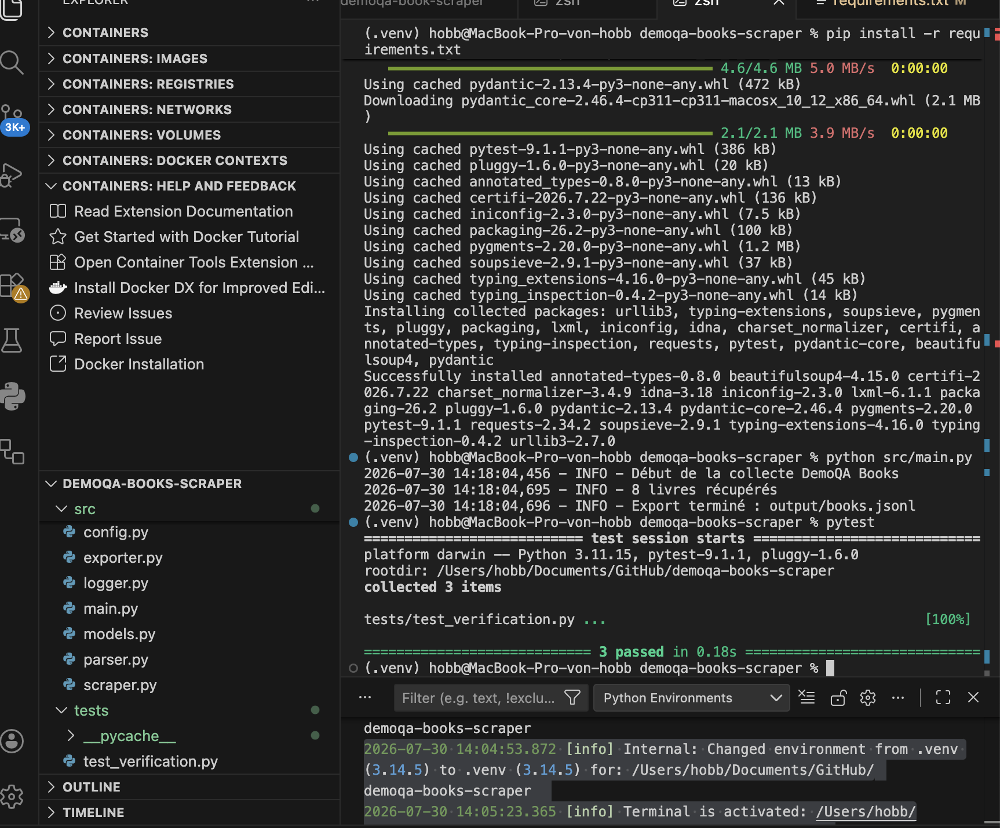

# DemoQA Books Scraper

## Projet Web Scraping moderne et industrialisation

### Membres du groupe

* Célia Merabet
* Bouyabri Mohamed

---

## 1. Présentation du projet

Ce TP consiste à développer un collecteur Web explicable permettant d'extraire les informations bibliographiques du site DemoQA Books.

La cible attribuée est :

URL :
https://demoqa.com/books

Objet métier :
Book

Le scraper récupère les métadonnées des livres disponibles et produit un fichier JSONL exploitable.

---

## 2. Objectifs

Le programme doit :

- diagnostiquer la source réelle des données ;
- récupérer les informations des livres ;
- normaliser les données ;
- éviter les doublons ;
- produire un fichier JSONL ;
- fournir des journaux d'exécution ;
- être facilement reproductible.

---

## 3. Données collectées

Pour chaque livre :

* title
* author
* publisher
* isbn
* pages
* url
* date de collecte

---

## 4. Technologies utilisées

Langage :

* Python 3.x

Bibliothèques :

* requests
* BeautifulSoup4
* pydantic
* pytest

---

## 5. Installation

Créer un environnement virtuel :

```bash
python -m venv .venv
```

Activation :

Mac/Linux :

```bash
source .venv/bin/activate
```

Installation :

```bash
pip install -r requirements.txt
```

---

## 6. Exécution

Lancer le scraper :

```bash
python src/main.py
```

Le résultat sera généré dans :

```
output/books.jsonl
```

---

## 7. Architecture

Le projet est organisé en plusieurs modules :

* scraper.py : récupération des données
* parser.py : extraction et nettoyage
* models.py : modèle Book
* exporter.py : génération JSONL
* logger.py : suivi de l'exécution
  # Résultat

Le programme génère automatiquement :

```
output/books.jsonl
```

Chaque ligne correspond à un objet JSON représentant un livre.

Exemple : 

```json
{
  "isbn":"9781449325862",
  "title":"Git Pocket Guide",
  "author":"Richard E. Silverman",
  "publisher":"O'Reilly Media",
  "pages":234
}
```


